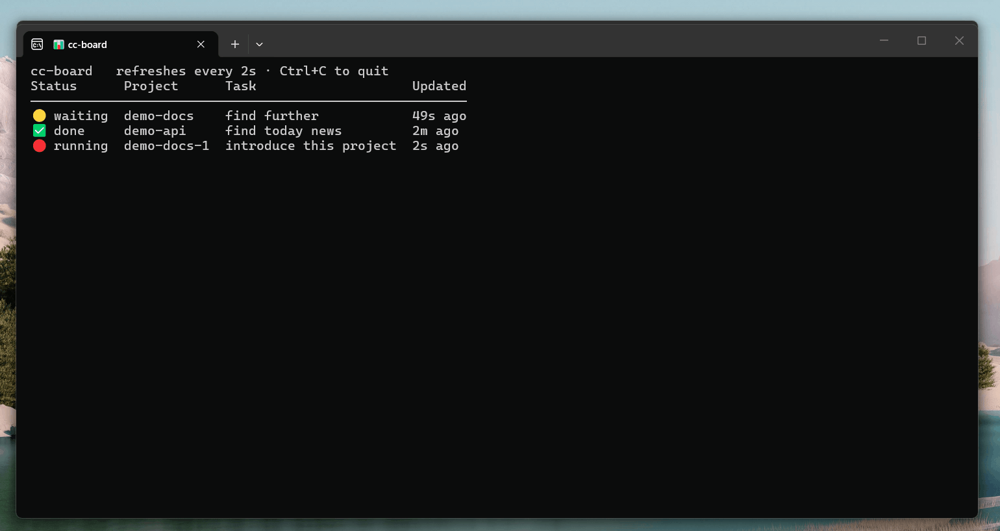

# cc-board

> A live dashboard for all your running Claude Code sessions — see at a glance which is **running / waiting on you / done**, and which project each is in.
>
> 一个**多 Claude Code 会话**的实时看板:一眼看清你开的每个 CC 在干嘛(🔴运行中 / 🟡等你确认 / ✅完成 / ⚪空闲)、在哪个项目、最近交代的活是什么。

开多个 Claude Code 同时干活时,根本顾不过来——哪个跑完了、哪个在等你点确认、哪个还在跑?cc-board 把它们汇总成一张每 2 秒刷新的表:



---

## 它怎么工作

1. **`cc-report.sh`**(挂在 Claude Code 的 hook 上)—— 每次会话状态变化,把"状态 + 项目 + 你交代的活"写到 `/tmp/cc-status/<终端>`,按终端(pts)区分每个会话。
2. **`cc-dashboard.sh`** —— 扫描所有活着的 `claude` 进程,读上面的状态文件,每 2 秒刷新成表。
3. **`cc-format.py`** —— 按"显示宽度"对齐(中文/emoji 算 2 格、安全截断不切坏中文)。

---

## 依赖

- **Linux 或 WSL** + `bash` + `python3`。**`python3` 在 WSL/Ubuntu 上系统自带、一般无需安装**(只用来把中文/emoji 列对齐);整个工具**无任何第三方库**。
- 可选 —— **只有想用「按一个键弹出看板」时才需要**:**Windows Terminal** + **AutoHotkey v2**(见下面「可选:Windows 一键唤起」)。不想要这个便利就完全不用管。

> ⚠️ **目前仅支持 Linux / WSL**:看板靠 `/proc`、`ps`、pts 终端识别来找会话,**macOS 暂不支持**(欢迎 PR)。

---

## 安装

> 这是给**别人(或你换台电脑)**把它装起来的步骤,一共 3 步。

**1. 放脚本**(放哪都行,这里以 `~/.claude/` 为例):
```bash
cp cc-report.sh cc-dashboard.sh cc-format.py ~/.claude/
chmod +x ~/.claude/cc-report.sh ~/.claude/cc-dashboard.sh ~/.claude/cc-format.py
```

**2. 把 4 个 hook 加进 `~/.claude/settings.json`**(hook = Claude Code 在某些时刻**自动帮你跑的命令**;这 4 个让它在「发消息 / 干活 / 等你确认 / 完成」时把状态报出来):
```json
"hooks": {
  "UserPromptSubmit": [
    { "hooks": [ { "type": "command", "command": "bash ~/.claude/cc-report.sh running" } ] }
  ],
  "PostToolUse": [
    { "matcher": "*", "hooks": [ { "type": "command", "command": "bash ~/.claude/cc-report.sh running" } ] }
  ],
  "Notification": [
    { "hooks": [ { "type": "command", "command": "bash ~/.claude/cc-report.sh waiting" } ] }
  ],
  "Stop": [
    { "hooks": [ { "type": "command", "command": "bash ~/.claude/cc-report.sh done" } ] }
  ]
}
```

> ⚠️ **如果你的 `settings.json` 已经有内容**:别整段粘贴覆盖!把这 4 个 hook **合并进你已有的 `"hooks"` 对象**(已有 `hooks` 就往里加这几项;完全没有,才整个加一个 `"hooks": {...}`)。同一个 JSON 里 key 不能重复。

**3. 跑看板**(任意终端):
```bash
bash ~/.claude/cc-dashboard.sh
```
就这样——开几个 CC,这张表就会显示它们。

---

## 可选:Windows 一键唤起

**A. Windows Terminal profile**(给看板一个专属标签):
```json
{
  "name": "CC看板",
  "commandline": "wsl.exe -d Ubuntu -- bash ~/.claude/cc-dashboard.sh",
  "suppressApplicationTitle": true
}
```

**B. 全局热键 `Win+\`` 开/收看板**(`ccboard.ahk`,需要 AutoHotkey v2):
双击运行 `ccboard.ahk` 后,按 `Win+\`` 唤起看板、再按收起。
- 它靠窗口标题 `CC看板` 来找/切看板窗口——确保上面 WT profile 的 `name` 也叫 `CC看板`(或自行改 ahk 里的标题)。
- 若 Windows Terminal 已把 `Win+\`` 绑给了 quake,先在 WT settings 里删掉那条 `globalSummon` 的 `win+\`` 绑定,免得抢键。
- `ccboard.ahk` 里还附带了作者自用的"两窗口快速切换"(`Ctrl+1/2` 锁窗、`Alt+\`` 互切),可删可留。

---

## 已知限制

- 仅 Linux / WSL(见上)。
- 多开 WT 窗口时,ahk 按标题 `CC看板` 匹配看板窗口;若你有别的窗口标题也含这几个字可能误匹配。

## License

[MIT](LICENSE) —— 随便用 / 改 / 卖,保留版权声明即可。
